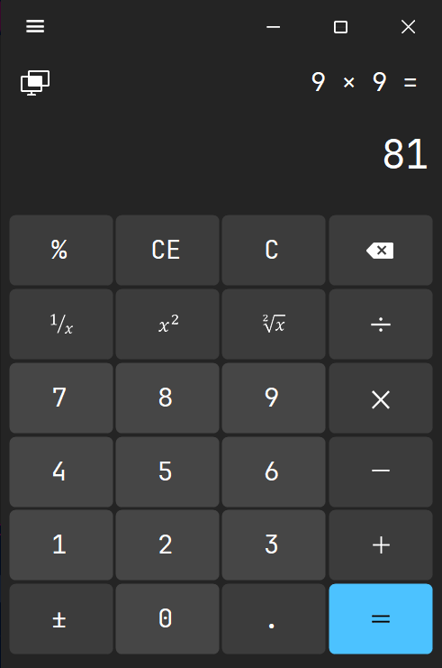
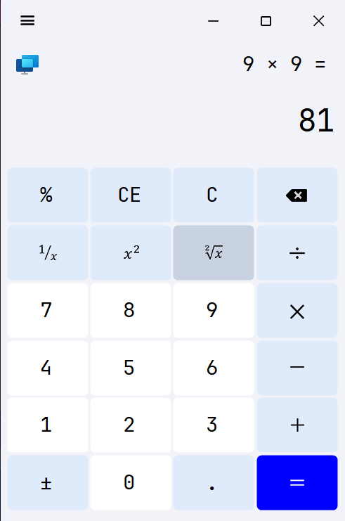

  <h1>🧮 WINDOWS 11 Calculator</h1>
  <p><em>A sleek, modern, and highly responsive Windows 11 Calculator clone built with C# and WinForms.</em></p>

  <!-- Shields.io Badges -->
  <p>
    
    
    
    
    
    
    
    
    
    
    
    
    
    
    
  </p>
  <div align="center">
 
  </div>

---

## 📑 Table of Contents
- [Features](#-features)
- [Screenshots](#-screenshots)
- [Tech Stack](#-tech-stack)
- [Project Structure](#-project-structure)
- [Getting Started](#-getting-started)
- [Roadmap](#-roadmap)
- [Contributing](#-contributing)
- [License & Author](#-license--author)

---

## ✨ Features
- **🎨 Pixel-Perfect Fluent UI:** Carefully crafted UI to match the native Windows 11 design language, including custom borders and button hover effects.
- **🌗 Dynamic Theming:** Seamlessly toggle between Light and Dark modes with real-time UI updates.
- **📱 Responsive Layout:** Form elements scale fluidly when the application window is resized.
- **🔢 Advanced Math Engine:** Accurately handles standard arithmetic, floating-point operations, and division by zero exceptions.
- **⌨️ Keyboard Support:** Fully mapped keyboard shortcuts for rapid calculations without a mouse.

---

## 📸 Screenshots

| ☀️ Light Mode | 🌙 Dark Mode |
| :---: | :---: |
|  |  |
| *Clean, bright interface for daytime use.* | *Eye-friendly dark aesthetics for low-light environments.* |

*(Note: Replace the placeholder image links above with your actual repository image paths).*

---

## 🛠️ Tech Stack

| Component | Technology / Tool |
| --- | --- |
| **Primary Language** | C# |
| **Framework** | .NET 4.8 |
| **UI Platform** | Windows Forms (WinForms) |
| **IDE** | Visual Studio 2026 |
| **Architecture** | Event-Driven / Object-Oriented (OOP) |

---

## 📂 Project Structure

```text
WIN11-Calculator/
├── Properties/              # Assembly info and settings
├── Resources/               # Application resources and assets
├── Round Button/            # Custom UI controls and components
├── img/                     # Images used for README documentation
├── .gitignore               # Git ignore rules
├── App.config               # Application configuration file
├── LICENSE                  # MIT License file
├── Program.cs               # Application entry point and bootstrapping
├── README.md                # Project documentation (You are here)
├── WIN11-Calculator.csproj  # C# Project file
├── WIN11-Calculator.slnx    # Visual Studio Solution file
├── app.manifest             # Windows application manifest for styling
├── calc_icon.ico            # Main application icon
├── frmCalc.Designer.cs      # Auto-generated UI components and layout
├── frmCalc.cs               # Core logic, math engine, and event handlers
└── frmCalc.resx             # Form specific resources

```

---

## 🚀 Getting Started

### Prerequisites

* [Visual Studio 2022 or higher](https://visualstudio.microsoft.com/) (with .NET desktop development workload).
* [.NET 4.8 SDK](https://dotnet.microsoft.com/download) or higher.

### Installation

1. **Clone the repository:**
```bash
git clone https://github.com/FALCONZeroX/WIN11-Calculator.git

```


2. **Navigate to the project directory:**
```bash
cd WIN11-Calculator

```


3. **Open the solution:**
Double-click `WIN11-Calculator.sln` to open it in Visual Studio.
4. **Build and Run:**
Press `F5` or click the **Start** button in Visual Studio to build and launch the application.

---

## 🗺️ Roadmap

* [x] Standard Calculator Mode
* [x] Light / Dark Theme Toggle
* [ ] Scientific Calculator Mode (Trigonometry, Logarithms)
* [ ] Programmer Mode (Hex, Bin, Dec, Oct)
* [ ] History Panel tracking past equations

---

## 🤝 Contributing

Contributions, issues, and feature requests are welcome!

1. Fork the Project.
2. Create your Feature Branch (`git checkout -b feature/AmazingFeature`).
3. Commit your Changes (`git commit -m 'Add some AmazingFeature'`).
4. Push to the Branch (`git push origin feature/AmazingFeature`).
5. Open a Pull Request.

---

## 📜 License & Author

Distributed under the **MIT License**. See `LICENSE` for more information.

**Developed with ❤️ by FALAH FATHEL**

* GitHub: [@FALCONZeroX](https://www.google.com/search?q=https://github.com/FALCONZeroX)
